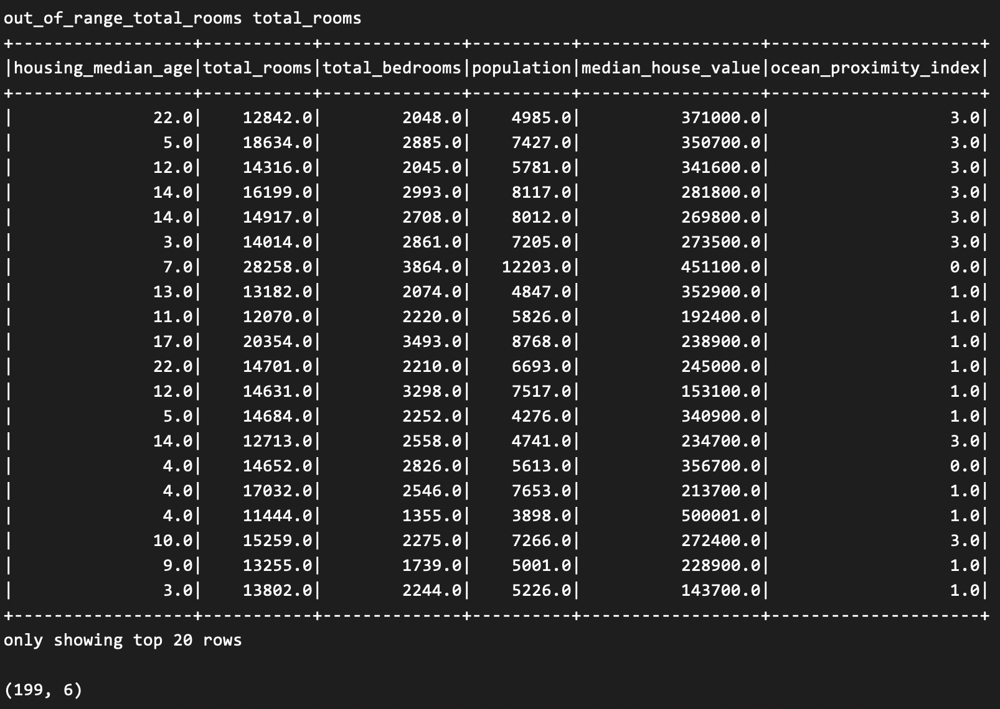
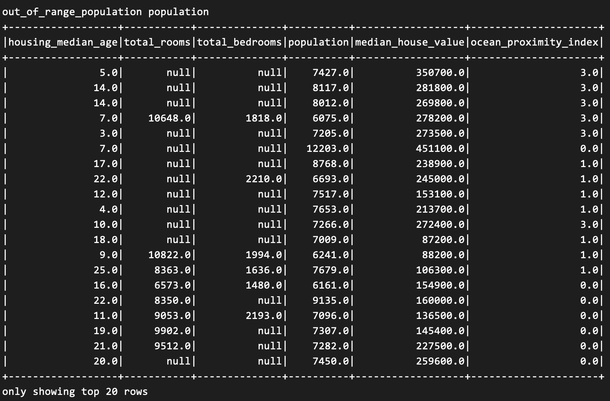
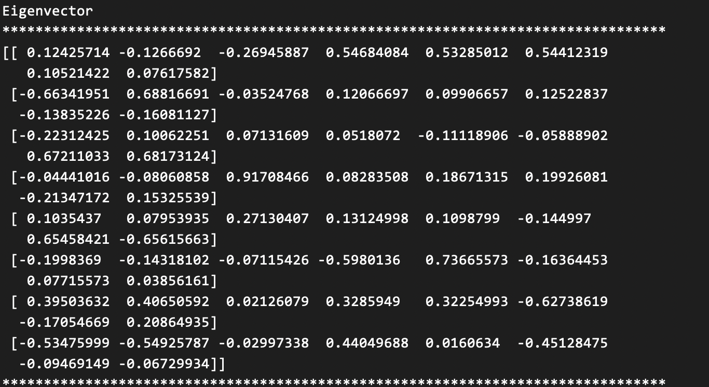
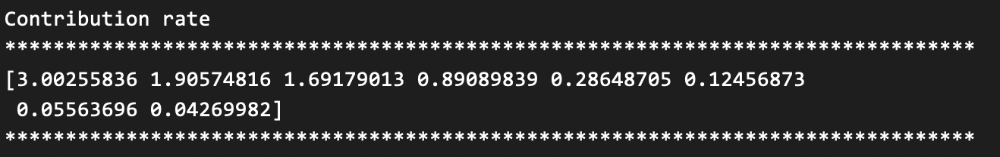
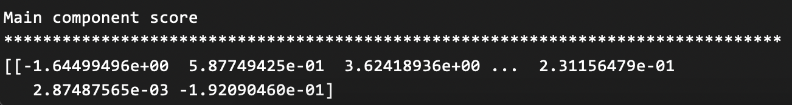

# BDM-Group8-Assignment3

<hr>

### Authors

- Parker Hague
- Yuhan Jin
- Dax Jones
<hr>


### Contents

- Group_8_Task_1.py - referenced for task 4
- Group_8_Task_2_3_4.py - runs parts 1-4
- Group_8_Task_5.py - PCA
- data_correction.py - mostly same as Group_8_Task_1.py but the functions have outputs
- Group_8_README_1.txt
- Group_8_README_2_3_4.txt
- Group_8_README_5.txt

<hr>


### About

The main file `Group_8_Task_2_3_4` runs parts 1 through 4 of the program. That's the data correction, prediction algorithms,error calculation, and pipeline building.

The file `Group_8_Task_5` runs a principal component analysis on the dataset.

### General Usage Instructions

#### Logging into Hadoop Cluster

    ssh username@hadoop-nn001.cs.okstate.edu

#### Viewing the Dataset

    hdfs dfs -cat /user/kaggle/kaggle_data/california_housing.csv

<!-- todo -->

#### Running the Program

    spark-submit Group_8_Task_2_3_4.py
    spark-submit Group_8_Task_5.py

#### Expected Output

Each task has its own output. The output has been shown at the end of each subsection.

<hr>

## California Housing Prices Dataset

#### Dataset Fields

longitude,
latitude,
housing_median_age,
total_rooms,
total_bedrooms,
population,
households,
median_income,
median_house_value,
ocean_proximity

#### Sample Data

    -122.23,37.88,41.0,880.0,129.0,322.0,126.0,8.3252,452600.0,NEAR BAY
<hr>

## Task 1 - Data Correction

### Preliminary Setup

#### Feature / Target Selection

First, we need to decide which columns or features we are going to keep from the dataset
and which ones we are going to discard. We also need to determine which value we will be predicting (target value).
We decided to use the following columns as features for training our models:

1. `housing_median_age`
2. `total_rooms`
3. `total_bedrooms`
4. `population`
5. `ocean_proximity`

We also decided that our target value would be `median_house_value` because it seemed like the only dependent
variable when considering all of the fields in the dataset.

#### Category Indexing
One of the columns in our dataset, `ocean_proximity`, contained categorical data. Since this data is in a string
format, it cannot be put into the regression model. This makes sense because you can't do math operations on a 
word. We need a number to represent each instead. I used `StringIndexer` which looks at the column values and puts
the unique strings into a dictionary and assigns them a numerical value starting at 0. This way, for example, `NEAR BAY`
can be represented with a 0 and `INLAND` with a 1.
<hr>

### Part A - Define Out of Range

#### Approach 1-A

We need to filter out the outliers in the dataset so we can get a more accurate prediction from our models.
To do this, we need to determine a specific range that is reasonable for each column. We decided to take a
statistical approach when determining the range of values to keep. If we assume our data follows a normal
distribution then we know that 97% of our data should fall between +- 3 standard deviation from the mean.
Using this knowledge, we decided to filter out datapoints that were **4 standard deviations** from the mean as
we consider these to be extreme outliers. In the end, we **filtered out 598 values**. This accounts for **2.89%** of
the dataset. So now that we have determined which values to get rid of, what do we do with them?

Once we select the values that are out of their specified range, we set their value to `null`. There is a very
important reason for this. We set the bad values to `null` because the next part of the pipeline process is a
function that will find each `null` value and replace it when the average of its **k nearest neighbors**.

#### Implementation 1-A

This line here replaces the values that are out of range of the `lower_bound` and `upper_bound` to `None` which is the same
as null.

```python 
{
    house_price_df.withColumn(col_to_correct, when(
        ~col(col_to_correct).between(lower_bound, sdf[col_to_correct].mean() + upper_bound), None).otherwise(col(col_to_correct)))
}
```

#### Output 1-A

The following shows the number of null counts before the out of range function is executed.


The following shows some of the collected rows that contain out of range values for each column.

Out of range total_rooms


Out of range total_bedrooms


Out of range population


The following shows the number of null values after all the range correcting has taken place.

<hr>

### Part B - Replace Missing Values

#### Approach 1-B

We have a number of options when deciding how to handle the missing values. We could just replace their values with
the mean of its column, but that wouldn't give us a value that's correlated to the rest of the other values in the row.
Instead, we can replace the value using some kind of similarity algorithm. We decided to use the **KNN Imputer** from the
sklearn library.

The Imputer works by specifying a `k` value. This value specifies how many of the next closest (or similar) datapoints the
algorithm will use when determining the replacement value. How does it determine which points are similar? It calculates the
**euclidean distance** of the row with the missing value to all of the other rows in the dataset. The vectors with smaller
euclidean distances are more similar. Once we know the `k` most similar rows, we can replace the missing value by getting
the average of the `k` rows with respect to the specific missing value's column. By using the `k` most similar datapoints to
calculate the average, we can get a more accurate approximation of the missing value.

#### Implementation 1-B

The following is the code that runs the KNN Imputer. You can see here that we've chosen to select the 4 most 
similar neighbors or datapoints to take the average of.

```python 
{
    imputer = KNNImputer(n_neighbors=4)
    knn_imputed_matrix = imputer.fit_transform(pandas_df)
}
```

#### Output 1-B

The following shows the number of null counts before the KNN Imputer operation takes place.


The following shows the number of null counts after the KNN Imputer operation takes place.

<hr>


## Task 2 - Prediction Algorithm

### Part A - Linear Regression

#### Approach 2-A

The first prediction algorithm we used was linear regression. Linear regression is used to predict a **continuous**
value. In our case, our continuous value will be the target value, `median_house_value`. We will use the five features,
`housing_median_age`, `total_rooms`, `total_bedrooms`, `population`, `ocean_proximity` as inputs into the linear regression
model to make our prediction.

Before inputting them into the model, we first pass our dataframe into a `VectorAssembler`. The `VectorAssembler` takes each
row and column of the dataframe and turns them into row vectors. This list of vectors allows us to have an
input format that the model will accept.

The model finished with an RMSE of **107356.26722174945**

#### Implementation 2-A
For the implementation, we were able to create a regression model of type `LinearRegression` and use it as an estimator.
This estimator can be passed in as one of the stages in the pipeline.

```python 
{
    lr_model = LinearRegression(featuresCol='features', labelCol='median_house_value', predictionCol="predictions")
    lr_pipeline = Pipeline(stages=[data_doctorer, vectorAssembler, lr_model])
    lr_pipeline_model = lr_pipeline.fit(training_data)
}
```

#### Output 2-A

After running the model and making predictions, we appended the predictions onto the model's dataframe. You can directly see
how the `median_house_value` compares to the `predictions`.

<hr>

### Part B - Random Forest

#### Approach 2-B
The second prediction model we created was a random forest. A random forest is an ensemble which is a collection
of multiple models. The benefit here is that each model uses different features and different sub samples of the 
dataset. In this case, our model will be predicting a **continuous** value. The value will again be the target value, `median_house_value`. We will ,again, use the five features, `housing_median_age`, `total_rooms`, `total_bedrooms`, `population`, `ocean_proximity` as inputs into the random forest model to make our prediction.

Before inputting them into the model, we ,again, pass our dataframe into a `VectorAssembler`. The `VectorAssembler` takes each row and column of the dataframe and turns them into row vectors. This list of vectors allows us to have an
input format that the model will accept.

The model finished with an RMSE of **93339.92233984661**

#### Implementation 2-B

For the implementation, we were able to create a regression model of type `RandomForestRegressor` and use it as an estimator.
This estimator can be passed in as one of the stages in the pipeline.

```python 
{
    rf_model = RandomForestRegressor(featuresCol="features", labelCol='median_house_value', predictionCol="predictions", maxBins=50, seed=100)
    rf_pipeline = Pipeline(stages=[data_doctorer, vectorAssembler, rf_model])
    rf_pipeline_model = rf_pipeline.fit(training_data)
}
```
#### Output 2-B

After running the model and making predictions, we appended the predictions onto the model's dataframe. You can directly see
how the `median_house_value` compares to the `predictions`.

<hr>

## Task 3 - Measure Accuracy

### Part A - RMSE
#### Approach 3-A

When making predictions with a model, we have to have a way to measure how well the model is doing. For our models,
we can use RMSE or root mean square error as a metric to calculate the error. The output of RMSE is a number that 
only has meaning with relation to the actual target values in the dataset. For example, if were guessing a person's height,
the RMSE may be a small number like less than 10. Since we're predicting house prices,m our RMSE is in the thousands.

#### Implementation 3-A

We specify what error function that the `evaluator` needs to use. `rmse` was passed here. After, we can get the 
RMSE values from the `evaluator`.

```python 
{
    evaluator = RegressionEvaluator(labelCol="median_house_value",
                                    predictionCol="predictions",
                                    metricName="rmse")
    evaluator.evaluate(lr_results)
    evaluator.evaluate(rf_results)
}
```

#### Output 3-A
The following shows the RMSE for the linear regression and random forest models.


<hr>

## Task 4 - Create a Spark Pipeline

### Part A - Pipeline

#### Approach 4-A
The spark pipeline allows us to streamline the process of cleaning our data, indexing the categorical data,
vectorizing the input, and making predictions on the data. We were able to use the built in functions 
for most of the stages like the indexing, linear regression model, random forest model, and vectorization.
However, since the data correction included a lot of custom manipulation, we had to turn this into our own
custom transformer for the pipeline. This process included turning the data correction into its own class 
that was we could create an object out of it and pass that object to the pipeline.

#### Implementation 4-A


The following shows the different stages of the pipeline. The `data_doctorer` is what handles the out of range
values, null values, and indexs the categorical data. The `vectorAssembler` turns our input into a format the 
pipeline can accept. The `lr_model` and `rf_model` are the actual prediction models.
```python 
{
    lr_pipeline = Pipeline(stages=[data_doctorer, vectorAssembler, lr_model])
    rf_pipeline = Pipeline(stages=[data_doctorer, vectorAssembler, rf_model])
}
```

#### Output 4-A

See the Linear Regression and Random Forest subsections as the output from the pipeline is shown in each 
respective section.
<hr>


## Task 5 - Principal Component Analysis

### Part A - Item Vector, Contribution Rate, & Main Component Score


#### Approach 5-A
The principal component analysis can be used for several reasons. It can be used to identify which 
features contribute mostly to the output. It can also be used in cases of dimensionality reduction
where we need to get rid of some features because we have too many. We have done the analysis for our
dataset and here are the findings.

The first set of outputs tells which variables carry the most weight for each component.

The second set of outputs will show the eigenvectors of the components that contain the most new information or variance.

The last set of output shows the scores of how much each variable affects its output.
#### Implementation 5-A

```python 
{
    pca.components_
    pca.explained_variance_
    print (data_frame_four)
}
```

#### Output 5-A








## Conclusion
The random forest model yielded a lower error than the linear regression model. Therefore, the 
random forest model works better for this dataset. We think we could have gotten the error lower
if we did the PCA before we made our predictions instead of after. We also think we may have had 
better predictions if we used more then just five features. Overall, the algorithms predicts decently
close in most cases.
